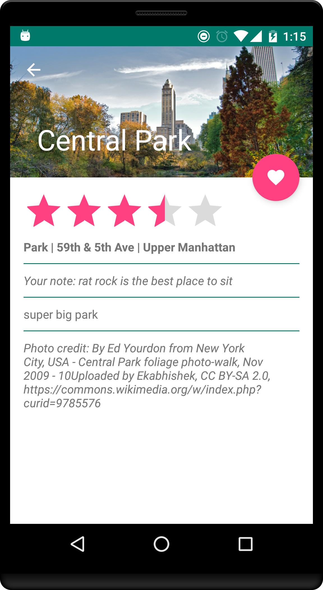

#####Charles Drews

Project 2 - Neighborhood Guide App
=============

**Home screen:** shows all places in database until user searches or filters to narrow it down
* User query is searched for in 4 database columns: Title, Location, Neighborhood, Category
* Query is broken into tokens (at spaces); for a record to be returned, each token must appear in that record, but not necessarily in the same field (e.g. token 1 may appear in Title, and token 2 may appear in Location)
* Search updates on each keypress, not only on submit; soft keyboard closes on submit
* Filter places by category using the filter icon in the toolbar which launches a popup with a spinner of categories
  * Clear filter w/ "Clear Filter" button in popup, or select "All" from the spinner
  * Toolbar icon changes to blue if a filter is active; back to white when cleared
* Can both search and filter in either order
  * Both are applied regardless which one is applied first
  * Filters and searches are also both preserved and recreated upon device rotation
* Add item to favorites by clicking the heart icon in the place listing; success is noted via Snackbar and by a change in the icon

**Favorites screen:** list of favorite places; navigate here via the heart icon in the home screen toolbar
* Search & filter favorites w/ same functionality as on home screen, just limited to favorite places
* Remove places from favorites by clicking the place's minus icon; success is noted via Snackbar and change in card appearance
  * Can re-favorite the place by clicking the plus icon; success is noted via Snackbar and change in card appearance
  * Click the refresh icon in the toolbar to clear out the un-favorited places; success noted via Snackbar

**Detail screen:** navigate here by clicking a place from the list in either home or favorites screens
* Detail page shows all info for selected place
* Favorite or un-favorite the place via the floating action button; success is noted via Snackbar
* Add/update a rating (0-5 stars in 0.5 star increments); success is noted via Snackbar
* Add/update a note with their comments about the selected place; success is noted via Snackbar
  * Click on note (or "click here to add note" textview if note not yet added) to launch popup with text input
  * Draft input is saved if user closes popup by clicking outside it (i.e. not by clicking the cancel button) and input is pre-populated with that draft the next time the popup is launched
